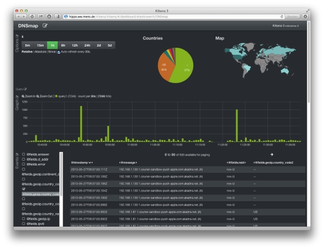

# Stash53

A work in progres. This was originally forked from [passivedns](https://github.com/gamelinux/passivedns), so you're probably better off there!

### Modifications to the original code

* Disabled `-X` option
* Enabled checks for all qtypes and rcodes
* Added `json.[ch]` from ccan
* Added `emit.[ch]` with support for ZeroMQ, Redis, and MQTT
* Added `-e` to specify emitter output:
  * For Redis: `127.0.0.1/6379`
  * For MQTT: `127.0.0.1/1183`
* Added `-O` for specifying PUB topic (Redis and MQTT)
* Added `-N` for specifying "nsid" (nameserver ID)
  

### Original README

Please see the [original README](README)

